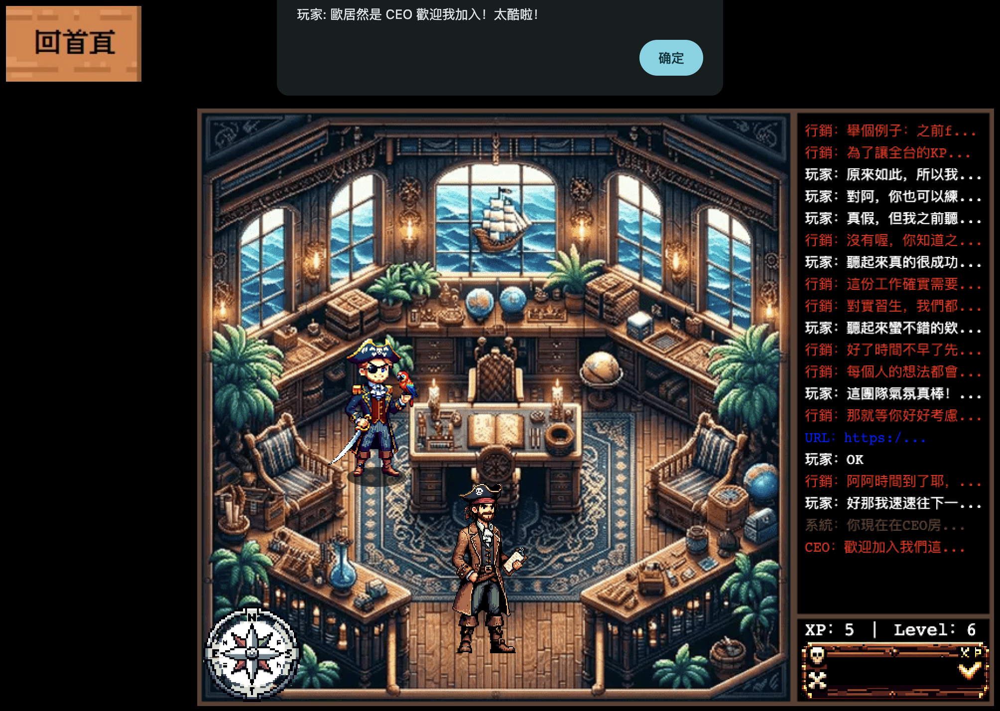

# Job Hunt RPG - Apply for jobs in an RPG!

## Overview
- The concept of this project is to allow for job-seeking scallywags to apply for their next job as their own RPG videogame character!
- Normal job application systems are boring, repetitive, and don't treat you like the character that you are!
- Apply for jobs in multiple languages!
- Interactiveness, unlike conventional job application systems!
- Character customization! (future)
- Different open worlds for different companies and different job portals! (future)

## Tech Stack
- This project was created with Phaser 3, an HTML5 browser-based game framework. It was built using JavaScript, and requires development in either JavaScript or Typescript.
- I opt to use TypeScript since it is more powerful and more scalable than JavaScript (and also since more tutorials I watched gave good examples for it),
- The assets were created purely using prompting with NightCafe.studio and ChatGPT-4 and in combination with editing softwares.
- The 

An RPG that lets you discover about [Eosphorus](https://eosphor.us), our project submission to Far East Telecom's co-hosted competition with [ATCC 2023](https://atcc.co/21statcc/).

> Note: this project is still in Beta version. We are actively seeking supporters and contributors.  
> If you would like to contribute, please contact my LinkedIn: https://linkedin.com/in/austin-hua

## Files

- *main.ts* initializes the core game configuration and scenes, setting up the Phaser game environment with arcade physics and a pixel art style.
- *CST.ts* defines constants for scene identifiers, asset paths (images and audio), and sprite keys, serving as a centralized resource reference for the game.
- *FadeUtils.ts* provides utility functions for smooth scene transitions, offering fadeIn and fadeOut effects that enhance the visual experience of transitioning between game scenes.
- *SpeechBubble.ts* crafts customizable speech bubbles for in-game dialogue, dynamically generating them with tailored positioning, sizing, and text content.
- Scenes
    - *MainMenuScene.ts* orchestrates the game's main menu, integrating interactive buttons for navigation, audio management, and a floating logo effect, setting the stage for player interaction.
    - *OptionsScene.ts* provides a user interface for audio settings, featuring an interactive volume slider that allows players to adjust the game's sound levels.
    - *LoadingScene.ts* meticulously handles the preloading of game assets, including images and audio, while displaying a loading progress bar to inform players as assets are being loaded.
    - *CEOScene.ts* crafts an immersive office environment for the CEO level.
    - *HRScene.ts* transitions the player to the HR office setting.

## TODO
- Finish audio sliders with draggable adjustment for both music and sound effects.
- Design and implement tile set.
- Character sprites for the following characters: player (man), player (woman), HR officer, CEO, engineer, marketing
- Consider adding character selection menu, M/F, hair color, etc.
- Fix speech bubble jumping bug
- Implement text notification and speech UI
- Add UI class that overlays each scene in game. The UI should include: inventory (bottom), text chat/notification system (bottom left), and character information (top right).
- Backend needs to be updated from NodeJS to Django.
- Consider adding resume/CV AI so that the following information can be fetched/determined: basic info (name/education/job/contact info), suitable department.
